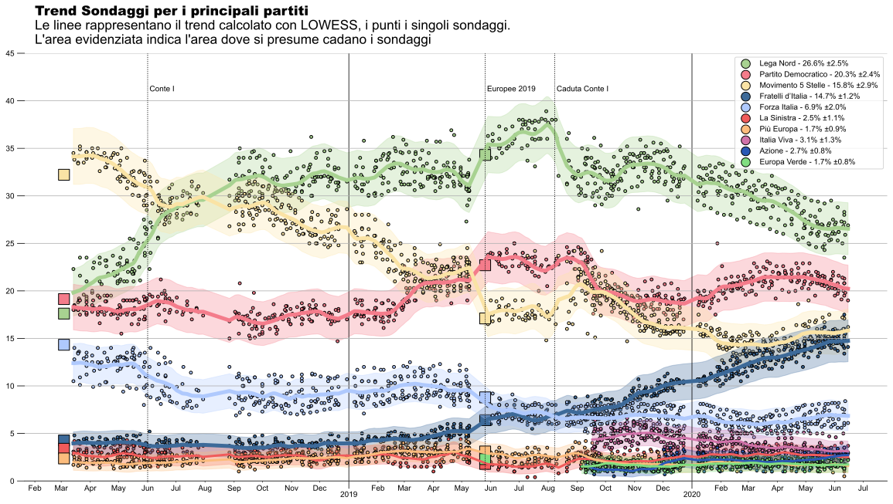
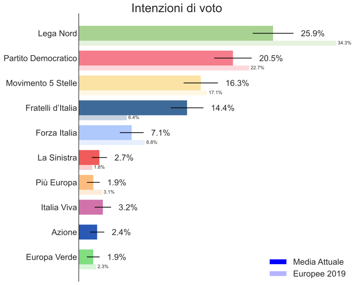

<link rel="stylesheet" type="text/css" href="https://cdn.datatables.net/1.10.21/css/jquery.dataTables.css">



 

<table id="polls" class="display compact" data-page-length='10' data-order='[[ 2, "desc" ]]' >
    <thead>
    <tr>
    <th rowspan="2">Istituto</th>
    <th rowspan="2">Committente</th>
    <th rowspan="2">Pubblicato</th>
    <th rowspan="2">Campione</th>
    <th>M5S</th>
    <th>PD</th>
    <th>Lega</th>
    <th>FI</th>
    <th>FdI</th>
    <th>Sinistra</th>
    <th>+Europa</th>
    <th>Verdi</th>
    <th>Azione</th>
    <th>IV</th>
    <th rowspan="2">Altri</th>
    </tr>
    <tr>
    <th style="background:#fae3a5;"></th>
    <th style="background:#f47c8b;"></th>
    <th style="background:#a8d291;"></th>
    <th style="background:#afc9fd;"></th>
    <th style="background:#3d6a99;"></th>
    <th style="background:#f05b5b;"></th>
    <th style="background:#fcbc7d;"></th>
    <th style="background:#81de81;"></th>
    <th style="background:#2a58b5;"></th>
    <th style="background:#d173aa;"></th>
    </tr>
    </thead>
    <tbody>
    
        <tr>
        
            <td class="dt-body-center">{{ cell[1] }}</td>
        
        </tr>
    
    </tbody>
</table>

Fonte: Sondaggi presi da [Europe Elects](https://europeelects.eu/european-union/italy/). Trend ottenuto tramite [LOWESS](https://en.wikipedia.org/wiki/Local_regression) 
