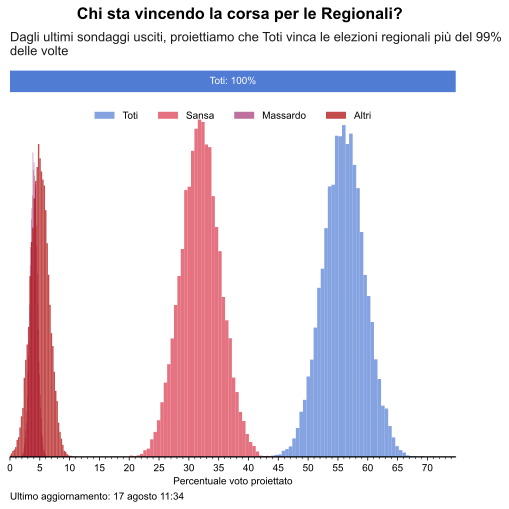
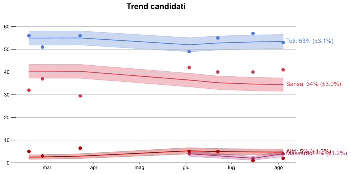

<link rel="stylesheet" type="text/css" href="https://cdn.datatables.net/1.10.21/css/jquery.dataTables.css">



<h1> Elezioni Regionali Liguria 2020 </h1>

 

<table id="polls" class="display compact" data-page-length='10' data-order='[[ 3, "desc" ]]'>
    <thead>
    <tr>
    <th rowspan="2">Istituto</th>
    <th rowspan="2">Committente</th>
    <th rowspan="2">Data iniziale</th>
    <th rowspan="2">Data finale</th>
    <th rowspan="2">Campione</th>
    <th>Toti</th>
    <th>Sansa</th>
    <th>Salvatore</th>
    <th rowspan="2">Altri</th>
    <th rowspan="2">Indecisi</th>
    </tr>
    <tr>
    <th style="background:#afc9fd;"></th>
    <th style="background:#f47c8b;"></th>
    <th style="background:#fae3a5;"></th>
    </tr>
    </thead>
    <tbody>
    
        <tr>
        
            <td class="dt-body-center">{{ cell[1] }}</td>
        
        </tr>
    
    </tbody>
</table>

