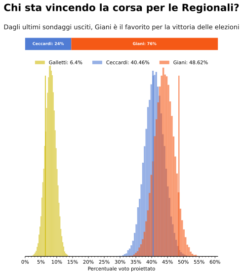

<link rel="stylesheet" type="text/css" href="https://cdn.datatables.net/1.10.21/css/jquery.dataTables.css">



 

<table id="polls" class="display compact" data-page-length='10' data-order='[[ 3, "desc" ]]'>
    <thead>
    <tr>
    <th rowspan="2">Istituto</th>
    <th rowspan="2">Committente</th>
    <th rowspan="2">Data finale</th>
    <th rowspan="2">Campione</th>
    <th>Giani</th>
    <th>Ceccardi</th>
    <th>Galetti</th>
    <th>Fattori</th>
    <th rowspan="2">Altri</th>
    </tr>
    <tr>
    <th style="background:#afc9fd;"></th>
    <th style="background:#f47c8b;"></th>
    <th style="background:#fae3a5;"></th>
    <th style="background:gray;"></th>
    </tr>
    </thead>
    <tbody>
    
        <tr>
        
            <td class="dt-body-center">{{ cell[1] }}</td>
        
        </tr>
    
    </tbody>
</table>

**Come Funziona?** Il modello simula 20000 elezioni basandosi sulle medie dei sondaggi regionali e su quanta incertezza storicamente ci sia sui risultati elettorali partendo dalle medie dei sondaggi. Tutti i risultati delle simulazioni vengono mostrati nel grafico centrale dove più è alta la barra più è probabile il risultato di un dato candidato.
(Attenzione però, i risultati ai bordi, per quanto improbabili sono comunque possibili!)

